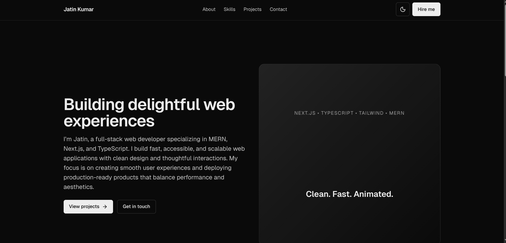

# Jatin Kumar's Portfolio
---
**visit here: https://portfolio-phi-lake-xi9cvdnaw5.vercel.app **
---

Welcome to my personal portfolio built with **Next.js**, **TypeScript**, **Tailwind CSS**, and **Framer Motion**.  
This project showcases my journey as a full-stack developer, highlighting my skills, projects, and experiences.

---

## **🚀 Getting Started**

To run this project locally:

```bash
npm install
npm run dev
# or
yarn dev
# or
pnpm dev
# or
bun dev
```
Open http://localhost:3000 in your browser to see the result.

## **🧩 Features**

Responsive Design: Optimized for desktop and mobile.

Dynamic Routing: Project pages use Next.js dynamic routes.

SEO Optimized: Built-in SEO features for better discoverability.

Interactive UI: Smooth animations with Framer Motion.

## **🛠️ Built With**

Next.js – React framework for building fast web apps.

TypeScript – Static typing for safer code.

Tailwind CSS – Utility-first CSS framework for styling.

Supabase – Backend-as-a-Service for database and auth.

Framer Motion – Library for animations and transitions.

## **📂 Project Structure**

```
public/
  chatter-dark.png
  clyro.png
  j.jpg
  portfolio.png
  quick-cart.png

src/
  app/
    globals.css
    layout.tsx
    page.tsx
  components/
    header.tsx
    theme-provider.tsx
    ui/
      button.tsx
  sections/
    about.tsx
    contact.tsx
    experience.tsx
    hero.tsx
    index.ts
    projects.tsx
    skills.tsx
  lib/
    utils.ts

.gitignore
README.md
eslint.config.mjs
next.config.ts
package.json
package-lock.json
postcss.config.mjs
tsconfig.json
```

## **📸 Preview**



## **📄 License**

This project is licensed under the MIT License.
